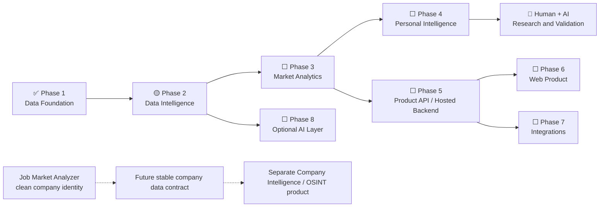

# Product Roadmap

This roadmap is directional. It describes meaningful product milestones, not a release promise or fixed schedule.

## Status Legend

- ✅ **Completed** — implemented and tested; live validated where live behavior matters.
- 🟡 **In progress / next** — the current active milestone or immediate next validation.
- ⬜ **Planned** — a future implementation direction.
- 🔵 **Research / validation** — a hypothesis that requires evidence before becoming a product recommendation.

## Where We Are Now

| Area | Status | Evidence / next boundary |
|---|---|---|
| Core domain model: `RawJob`, `NormalizedJobPosting`, `JobPosting`, `CanonicalJob` | ✅ | Implemented with explicit responsibilities and source identity |
| SQLite schema, deterministic serialization/hashing, `SQLiteJobRepository` | ✅ | Tested persistence and transaction behavior |
| Repeated-observation same-source deduplication | ✅ | Identical observations reuse the posting and do not duplicate raw JSON |
| Remote OK integration | ✅ | Offline tests plus successful real one-shot collection |
| Remote OK repeated-run validation | ✅ | Second live run created no duplicate posting or raw observation |
| Web3.career integration | ✅ | Offline tests plus successful real one-shot and repeated-run collection validation |
| Normalized source-tag intelligence input | ✅ | Committed normalized analyzer input contract with migration and regression coverage |
| Skill Taxonomy v1 / deterministic extractor | ✅ | Committed pure taxonomy-backed extraction with direct mention evidence |
| Data-driven Skill Taxonomy v2 | ✅ | Bounded additions and ambiguity guards validated against local Remote OK and Web3.career data |
| Versioned skill persistence / recomputation | ✅ | Derived SQLite analysis runs and evidence are implemented and regression-tested |
| Manual real-data skill validation | ✅ | V1 and v2 analyzed twice against both local 100-posting smoke databases with integrity checks |

## Visual Direction

## Phase 1 — Data Foundation

### Completed

- ✅ Core domain records and `(source_provider, source_scope, external_id)` identity.
- ✅ SQLite schema, repository boundary, deterministic serialization, and hashes.
- ✅ Same-source repeated-observation behavior and raw provenance.
- ✅ Remote OK offline integration and live one-shot CLI.
- ✅ Real Remote OK first-run and second-run dedup smoke checks.
- ✅ Web3.career offline collector, normalization, source terms, token-log protection, and SQLite integration.
- ✅ Real Web3.career first-run and repeated-run dedup smoke checks.

### Current / next

- 🟡 Review [the bounded role-classification design](ROLE_CLASSIFICATION_DESIGN.md) before approving any implementation.

### Planned foundation work

- ⬜ Add selected high-quality sources such as Greenhouse, Lever, Ashby, and other appropriate general, remote, or Web3 sources.
- ⬜ Expand sources according to reliability, legal access, provenance quality, and market coverage rather than an arbitrary target count.
- ⬜ Prepare consistent company identity without introducing the separate Company Intelligence domain.
- ⬜ Develop high-confidence cross-source canonical linking while preserving every source posting.

## Phase 2 — Data Intelligence

- ✅ Normalized source-observed tags persisted as deterministic analyzer input; these are not canonical skills.
- ✅ Skill Taxonomy v1 and pure deterministic extraction with structured mention evidence.
- ✅ Data-driven Skill Taxonomy v2 with bounded direct mentions and contextual false-positive guards.
- ✅ Versioned, recomputable skill analysis runs with dedicated input hashes and persisted direct mention evidence.
- ✅ Manual real-data validation of skill coverage and evidence on local Remote OK and Web3.career datasets.
- ✅ Role-classification design proposal using local title evidence; no role implementation or schema exists.
- ⬜ Role classification implementation.
- ⬜ Company normalization.
- ⬜ Geography and remote-restriction normalization.
- ⬜ Salary normalization with explicit disclosed, estimated, and derived provenance.
- ⬜ Seniority detection.
- ⬜ Vacancy lifecycle and historical state.
- ⬜ Data-quality scoring only where a clear interpretation and use case justify it.

## Phase 3 — Market Analytics

- ⬜ Demand by role and skill.
- ⬜ Common skill and technology combinations.
- ⬜ Salary distributions with provenance-aware filtering.
- ⬜ Geography, remote availability, and remote restrictions.
- ⬜ Historical trends.
- ⬜ Source coverage and duplicate analysis.

Analytics should normally count `CanonicalJob` records while retaining source postings for provenance and comparison.

This removes duplicates only where postings already share a `CanonicalJob`. Complete cross-source canonical linking is not implemented yet, so current analytics must not claim complete cross-source deduplication.

## Phase 4 — Personal Intelligence

- ⬜ User-controlled skill profile.
- ⬜ Skill-gap analysis and job matching.
- ⬜ Learning opportunity coverage and evidence-informed ROI indicators.
- ⬜ Portfolio project suggestions based on market skill combinations, completeness, tests, deployment, documentation, and explainability.

These features must guide users without promising employment outcomes.

### Research track

- 🔵 Human + AI capability model.
- 🔵 `LEARN`, `LEARN + AI`, `AI-LEVERAGED`, and `AUTOMATE` categories.
- 🔵 Skill-pair and learning-sequence recommendations.
- 🔵 Repetitive-task automation opportunities.
- 🔵 Validation methodology, uncertainty, and recommendation quality.

This track remains research until its methods are validated. It must not be presented as objective truth or a guarantee.

## Phase 5 — Product API / Hosted Backend

- ⬜ PostgreSQL when dataset size or hosted concurrency justifies migration.
- ⬜ FastAPI or an equivalent API layer selected when the interface contract is ready.
- ⬜ Query and analytics APIs.
- ⬜ User preferences, including language preference.
- ⬜ Saved filters and searches.
- ⬜ Authentication only when a hosted multi-user product requires it.

The local open-source mode must remain supported.

## Phase 6 — Web Product

- ⬜ Visual dashboard and vacancy browser.
- ⬜ Role, skill, and salary explorers.
- ⬜ Regional and remote-restriction filters.
- ⬜ Historical charts and personal roadmap views.
- ⬜ Internationalization and user-selected presentation language.

Next.js/React is a likely direction, not a permanent architectural commitment. An equivalent frontend may be selected when implementation begins.

## Phase 7 — Integrations

- ⬜ Telegram, Discord, WhatsApp, and GitHub integrations.
- ⬜ Notifications and saved-search delivery.
- ⬜ Other clients where user demand justifies them.

Every integration must consume the shared core or product API. Interface-specific copies of collection, analytics, or recommendation logic are out of scope.

## Phase 8 — Optional AI Layer

- ⬜ Provider abstraction for OpenAI-compatible APIs, OpenRouter, DeepSeek, and other justified providers.
- ⬜ Bring-your-own API key support.
- ⬜ Optional enrichment and recommendations where deterministic methods are insufficient.
- ⬜ Cost controls, caching, prompt/extractor versioning, input hashes, confidence, and provenance.

Core collection, storage, filtering, deduplication, and basic analytics must continue to work without AI.

## Parallel Future Product — Company Intelligence / OSINT

The future product may use lawful public or open-source company information, but it remains a separate product and domain. Do not add its tables, modules, surveillance workflows, or product requirements to the current MVP.

## Maintenance Rules

- Update this roadmap only when a meaningful milestone changes.
- Do not mark a feature complete merely because a stub or placeholder exists.
- “Complete” means implemented and tested, plus live validation where live behavior matters.
- Keep hypotheses and recommendation models marked 🔵 Research until validated.
- Treat the roadmap as direction, not a promise, deadline, or release schedule.
