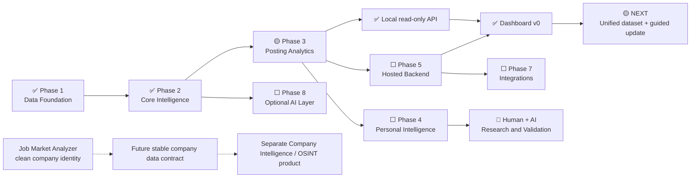

# Product Roadmap

This roadmap is directional. It describes meaningful product milestones, not a release promise or fixed schedule.

## Status Legend

- ✅ **Completed** — implemented and tested; live validated where live behavior matters.
- 🟡 **In progress / next** — the current active milestone or immediate next validation.
- ⬜ **Planned** — a future implementation direction.
- 🔵 **Research / validation** — a hypothesis that requires evidence before becoming a product recommendation.

## Where We Are Now

| Area | Status | Evidence / next boundary |
|---|---|---|
| Core domain model: `RawJob`, `NormalizedJobPosting`, `JobPosting`, `CanonicalJob` | ✅ | Implemented with explicit responsibilities and source identity |
| SQLite schema, deterministic serialization/hashing, `SQLiteJobRepository` | ✅ | Tested persistence and transaction behavior |
| Repeated-observation same-source deduplication | ✅ | Identical observations reuse the posting and do not duplicate raw JSON |
| Remote OK integration | ✅ | Offline tests plus successful real one-shot collection |
| Remote OK repeated-run validation | ✅ | Second live run created no duplicate posting or raw observation |
| Web3.career integration | ✅ | Offline tests plus successful real one-shot and repeated-run collection validation |
| Himalayas integration | ✅ | Public JSON API, offline tests, two live runs, and SQLite integrity validation |
| Jobicy integration | ✅ | Public JSON API, offline tests, two live runs, and SQLite integrity validation |
| Remotive integration | ✅ | Attributed public JSON API, offline tests, two live runs, and SQLite integrity validation |
| We Work Remotely integration | ✅ | Official RSS, offline tests, duplicate-feed guard, two live runs, and SQLite integrity validation |
| Normalized source-tag intelligence input | ✅ | Committed normalized analyzer input contract with migration and regression coverage |
| Skill Taxonomy v1 / deterministic extractor | ✅ | Committed pure taxonomy-backed extraction with direct mention evidence |
| Data-driven Skill Taxonomy v2 | ✅ | Bounded additions and ambiguity guards validated against local Remote OK and Web3.career data |
| Versioned skill persistence / recomputation | ✅ | Derived SQLite analysis runs and evidence are implemented and regression-tested |
| Manual real-data skill validation | ✅ | V1 and v2 analyzed twice against both local 100-posting smoke databases with integrity checks |
| Role Classification V1 | ✅ | Committed pure deterministic classifier with bounded 200-posting local validation |
| Versioned role persistence / recomputation | ✅ | Committed schema v3, repository, exact identity, and analyzer-kind protections |
| Manual persisted role validation | ✅ | One-shot CLI and two-pass disposable-copy validation are committed |
| Multi-source expansion | ✅ | Nine supported sources: six feeds plus curated Greenhouse (16 boards), Lever, and Ashby (18 boards) ATS adapters |
| Dashboard v0 internal analytics/query layer | ✅ | Read-only exact-current overview, posting search, role/skill detail, and source summaries |
| Local read-only Dashboard API | ✅ | Committed loopback-only FastAPI adapter over posting-level analytics |
| Browser Dashboard v0 | ✅ | Committed browser UI over the local read-only API and validated on real persisted data |
| Guided update flow: source/analyzer registries, partial-failure policy | ✅ | Committed orchestration with credential skip, language capability validation, and idempotent reruns |
| Job Lifecycle v1 (freshness) | ✅ | Read-time 30-day active/stale boundary with explicit `include_stale` history access |
| Role Taxonomy v2 | ✅ | Evidence-driven revision mined from real Unknown titles; coverage rose from 32.9% to 45.6% |
| Seniority v1 (`seniority/en`) | ✅ | Title-only experience-axis analyzer persisted behind schema v4; live-validated on 2,871 postings |
| Geography v1 (`geography/en`) | ✅ | Arrangement plus region eligibility behind schema v5; live pass classified 86.2% of 5,548 postings |
| Unified personal-use dataset audit | ✅ | Real nine-source guided update run; findings recorded in `DATA_QUALITY_NOTES.md` |
| Salary normalization v1 (`salary/en`) | ✅ | Deterministic structured/text salary normalization with provenance, confidence, and guarded annualization behind schema v6; live pass estimated 104 postings (salary data remains thin because ATS endpoints do not publish it) |
| Deployment foundation (Docker, CI, hosted alpha) | ⬜ | Required before the public read-only website |

## Visual Direction

## Phase 1 — Data Foundation

### Completed

- ✅ Core domain records and `(source_provider, source_scope, external_id)` identity.
- ✅ SQLite schema, repository boundary, deterministic serialization, and hashes.
- ✅ Same-source repeated-observation behavior and raw provenance.
- ✅ Remote OK offline integration and live one-shot CLI.
- ✅ Real Remote OK first-run and second-run dedup smoke checks.
- ✅ Web3.career offline collector, normalization, source terms, token-log protection, and SQLite integration.
- ✅ Real Web3.career first-run and repeated-run dedup smoke checks.
- ✅ Credential-free Himalayas, Jobicy, Remotive, and We Work Remotely adapters.
- ✅ Offline per-source contracts, generic SQLite pipeline regression, two-pass live
  validation, database integrity, and documented data-quality limitations.

### Current / next

- ✅ Guided one-shot update flow: source/analyzer registries, partial source failure,
  credential skip, English capability validation, idempotency, and dashboard handoff
  are implemented, tested, and committed.
- ✅ Real nine-source update/dashboard cycle completed; findings recorded in
  `DATA_QUALITY_NOTES.md`. Job lifecycle (active/stale
  status instead of deletion) is the first planned vertical sprint after that audit.
  Ukrainian skill/role intelligence can then be a concrete next language sprint if
  desired; it is not implemented or implied now.

### Planned foundation work

- ✅ Pilot curated remote-friendly Greenhouse boards: 16 approved company boards
  collected through one credential-free request per board, with per-board
  isolation and documented attribution.
- ✅ Lever and Ashby ATS boards: curated spotify/palantir (Lever) and 18 AI-era
  remote-friendly boards including OpenAI, Cohere, Notion and Linear (Ashby),
  following the same per-board isolation pattern. New company boards are now
  one-token registry additions across three ATS platforms.
- ⬜ Continue source expansion according to reliability, legal access, provenance
  quality, and market coverage rather than an arbitrary target count.
- ⬜ Prepare consistent company identity without introducing the separate Company Intelligence domain.
- ⬜ Develop high-confidence cross-source canonical linking while preserving every source posting.

## Phase 2 — Data Intelligence

- ✅ Normalized source-observed tags persisted as deterministic analyzer input; these are not canonical skills.
- ✅ Skill Taxonomy v1 and pure deterministic extraction with structured mention evidence.
- ✅ Data-driven Skill Taxonomy v2 with bounded direct mentions and contextual false-positive guards.
- ✅ Versioned, recomputable skill analysis runs with dedicated input hashes and persisted direct mention evidence.
- ✅ Manual real-data validation of skill coverage and evidence on local Remote OK and Web3.career datasets.
- ✅ Role Classification V1 pure implementation and bounded local read-only validation.
- ✅ Persisted versioned role analysis and recomputation with role/skill isolation.
- ✅ Role Taxonomy v2: evidence-driven expansion mined from 1,926 Unknown titles in
  the live seven-source dataset; posting-level coverage rose from 32.9% to 45.6%
  while generic engineering and management titles deliberately stay Unknown
  (ADR-021).
- ✅ Manual one-shot persisted role validation and bounded real-data report.
- ✅ Job Lifecycle v1 (freshness-based): read-time active/stale boundary with a 30-day
  window, active-only dashboard/API defaults, and an explicit `include_stale` history
  parameter; deletion is not part of retention (ADR-020). Source-provided expiry and
  richer lifecycle states remain future work.
- ⬜ Company normalization.
- ⬜ Geography and remote-restriction normalization.
- ⬜ Salary normalization with explicit disclosed, estimated, and derived provenance.
- ⬜ Seniority detection.
- ✅ Salary normalization v1: deterministic `salary/en` analyzer over normalized
  salary fields with structured/text provenance, direct/parsed confidence, and
  annualization only under known periods (2080h/260d/52w/12m conventions).
  Persisted behind schema v6; dashboard exposure follows validation.
- ✅ Geography / work-arrangement v1: deterministic `geography/en` analyzer over
  description, location, and structured remote flags; classifies
  remote/hybrid/onsite arrangement plus multi-label region eligibility
  (worldwide, Europe, North America, Latin America, Asia Pacific). Persisted as
  versioned runs behind schema v5; dashboard exposure follows once validated.
- ✅ Seniority detection v1: deterministic title-only experience-level analyzer
  (intern/junior/mid/senior/lead/staff/principal) persisted as versioned
  `seniority/en` runs behind schema v4; people-management words are deliberately not
  seniority evidence. Analytics exposure follows later once validated.
- ✅ Vacancy lifecycle and historical state: freshness-based active/stale boundary is
  implemented at the analytics layer (see Job Lifecycle v1 above); richer
  source-aware states remain future work.
- ⬜ Data-quality scoring only where a clear interpretation and use case justify it.

## Phase 3 — Market Analytics

- ✅ Posting-level overview, deterministic vacancy list/search, role and skill detail,
  skill co-occurrence, and source dataset summaries.
- ✅ Exact-current analyzer resolution with historical-run exclusion and explicit
  analyzed-zero/not-analyzed states.
- ⬜ Canonical-deduplicated demand by role and skill after linking is trustworthy.
- ⬜ Broader skill and technology combination analytics.
- ⬜ Salary distributions with provenance-aware filtering.
- ⬜ Geography, remote availability, and remote restrictions.
- ⬜ Historical trends.
- ⬜ Source coverage and duplicate analysis.

Analytics should normally count `CanonicalJob` records while retaining source postings for provenance and comparison.

This removes duplicates only where postings already share a `CanonicalJob`. Complete cross-source canonical linking is not implemented yet, so current analytics must not claim complete cross-source deduplication.

## Phase 4 — Personal Intelligence

- ⬜ User-controlled skill profile.
- ⬜ Skill-gap analysis and job matching.
- ⬜ Learning opportunity coverage and evidence-informed ROI indicators.
- ⬜ Portfolio project suggestions based on market skill combinations, completeness, tests, deployment, documentation, and explainability.

These features must guide users without promising employment outcomes.

### Research track

- 🔵 Human + AI capability model.
- 🔵 `LEARN`, `LEARN + AI`, `AI-LEVERAGED`, and `AUTOMATE` categories.
- 🔵 Skill-pair and learning-sequence recommendations.
- 🔵 Repetitive-task automation opportunities.
- 🔵 Validation methodology, uncertainty, and recommendation quality.

This track remains research until its methods are validated. It must not be presented as objective truth or a guarantee.

## Phase 5 — Product API / Hosted Backend

- ✅ Local read-only FastAPI boundary for Dashboard v0, with existing schema v6,
  explicit database selection, bounded GET routes, and per-request connections.
- ⬜ PostgreSQL when dataset size or hosted concurrency justifies migration.
- ⬜ Hosted deployment, authentication, and multi-user API policy when required.
- ⬜ User preferences, including language preference.
- ⬜ Saved filters and searches.
- ⬜ Authentication only when a hosted multi-user product requires it.

The local open-source mode must remain supported.

## Phase 6 — Web Product

- ✅ Dashboard v0: Overview, vacancy browser, URL-backed combined filters,
  role/skill detail, source coverage, and explicit local API error states.
- ⬜ Role, skill, and salary explorers.
- ⬜ Regional and remote-restriction filters.
- ⬜ Historical charts and personal roadmap views.
- ⬜ Internationalization and user-selected presentation language.

Next.js/React is the implemented local Dashboard v0 direction, not a permanent hosted
architecture commitment. The next step is real personal-use auditing, not another
invisible backend layer.

## Phase 7 — Integrations

- ⬜ Telegram, Discord, WhatsApp, and GitHub integrations.
- ⬜ Notifications and saved-search delivery.
- ⬜ Other clients where user demand justifies them.

Every integration must consume the shared core or product API. Interface-specific copies of collection, analytics, or recommendation logic are out of scope.

## Phase 8 — Optional AI Layer

- ⬜ Provider abstraction for OpenAI-compatible APIs, OpenRouter, DeepSeek, and other justified providers.
- ⬜ Bring-your-own API key support.
- ⬜ Optional enrichment and recommendations where deterministic methods are insufficient.
- ⬜ Cost controls, caching, prompt/extractor versioning, input hashes, confidence, and provenance.

Core collection, storage, filtering, deduplication, and basic analytics must continue to work without AI.

## Parallel Future Product — Company Intelligence / OSINT

The future product may use lawful public or open-source company information, but it remains a separate product and domain. Do not add its tables, modules, surveillance workflows, or product requirements to the current MVP.

## Maintenance Rules

- Update this roadmap only when a meaningful milestone changes.
- Do not mark a feature complete merely because a stub or placeholder exists.
- “Complete” means implemented and tested, plus live validation where live behavior matters.
- Keep hypotheses and recommendation models marked 🔵 Research until validated.
- Treat the roadmap as direction, not a promise, deadline, or release schedule.
